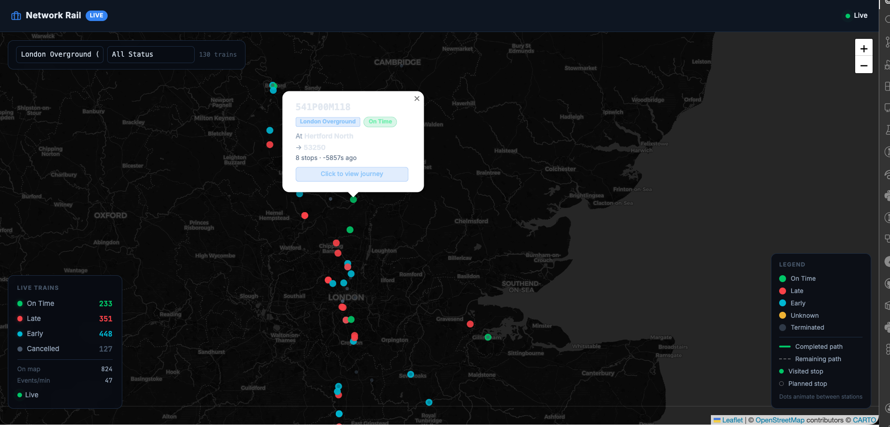
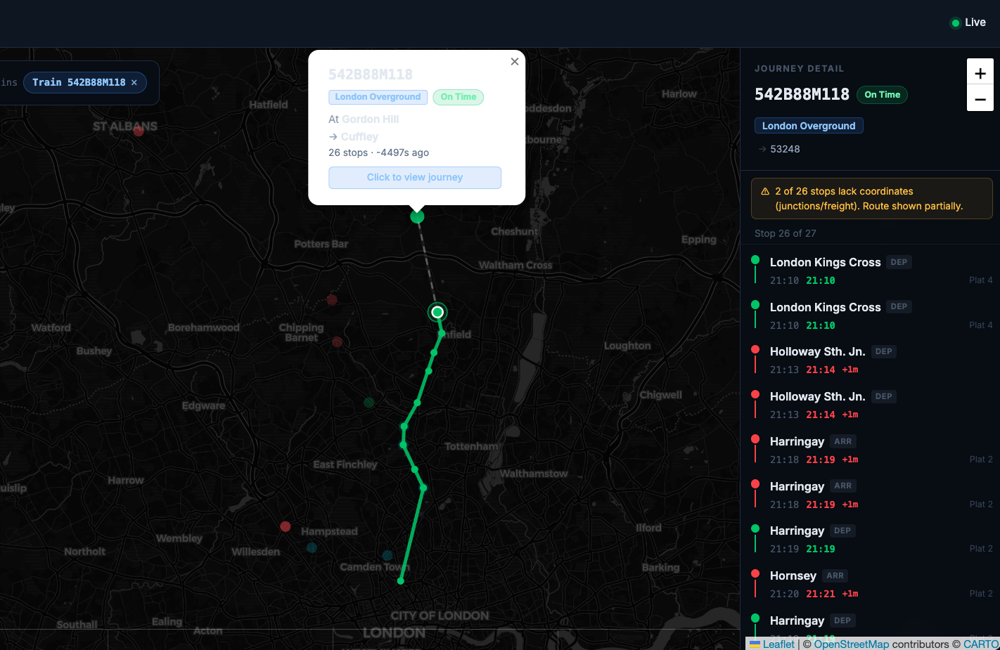

# Rail Track

> Yes, the name is a pun. We track rails. You're welcome.

Rail Track pulls live train movement data from the Network Rail open data feed and puts every active train in Great Britain on an animated map — right now, moving, colour-coded by how late it is. Click any dot and you get the full journey drawn out: where it's been, where it's going, stop by stop.

<table>
  <tr>
    <td></td>
    <td></td>
  </tr>
</table>

---

## What you're looking at

- **Thousands of live trains** — every train movement event from Network Rail, streamed in real time
- **Animated positions** — dots interpolate smoothly between stations at 60fps using `requestAnimationFrame`, so trains actually move instead of teleporting every 5 seconds
- **Click for journey** — solid line for the path already taken, dashed line for what's ahead, stop dots coloured by their own punctuality, glow ring on the current position
- **Colour by punctuality** — green (on time), red (late), cyan (early), grey (cancelled/terminated)
- **Filter by TOC or status** — narrow down to just CrossCountry, just late trains, whatever you want
- **Stats panel** — live counts and events/min so you know the feed is actually alive

---

## Architecture

Three processes, one data flow:

```
Network Rail STOMP
        │
        ▼
  ┌─────────────┐
  │    Feed     │  Python — STOMP consumer, state machine, IPC publisher
  └──────┬──────┘
         │ Unix domain socket  (newline-delimited JSON, rate-limited to 5s)
         ▼
  ┌─────────────┐
  │     API     │  FastAPI — caches map snapshot, WebSocket broadcaster,
  └──────┬──────┘  serves journey detail from MongoDB on click
         │ WebSocket /ws/map  +  REST /api/trains/{id}
         ▼
  ┌─────────────┐
  │  Frontend   │  React + Leaflet — rAF animation, route drawing
  └─────────────┘
         │
      MongoDB   (event persistence + cold-start replay + journey-on-demand)
```

| Service | Stack | Role |
|---|---|---|
| `services/feed` | Python, stomp.py, pymongo | Consumes STOMP, runs state machine, publishes via IPC |
| `services/api` | FastAPI, motor | Reads IPC, broadcasts WebSocket, serves REST |
| `frontend` | React, Vite, Leaflet, Zustand | Live map UI |
| MongoDB | — | Raw event store, replay source, journey backend |

---

## Engineering patterns

### Two-process IPC split
Feed and API are separate processes connected by a **Unix domain socket**. The feed is the authority — it runs the state machine, writes to MongoDB, and broadcasts. The API is a thin read layer. Either can restart independently.

The IPC publisher is a **broadcast model**: all connected API instances get every message. Dead clients are detected on next send and evicted. The socket file is cleaned up on startup so a crashed previous run never blocks binding.

### Rate-limited publishing
STOMP frames arrive in bursts — potentially hundreds of events per second. `publish_map_update()` is **coalescing**: it silently drops calls that arrive within 5 seconds of the last publish. The feed's in-memory state stays current on every event; clients see at most one map refresh every 5 seconds.

### In-memory state machine
All active trains live in a `dict[str, TrainState]`. Four message types drive state transitions: Activation (create entry), Cancellation (flag it), Movement (update position, append journey stop), Reinstatement (unflag). Each movement stop records actual vs planned timestamps and the scheduled run time to the next stop — the latter is what makes interpolation possible.

### Cold-start recovery
When the feed restarts it replays the last 6 hours of raw events from MongoDB through the exact same `update_train_from_event()` function used for live events. No separate hydration logic. The state machine doesn't know or care whether the event is live or replayed.

### On-demand journey from MongoDB
Journey detail (full stop list with coordinates) is only needed when a user clicks a train. The API queries MongoDB, replays the events for that one train, enriches each stop with lat/lng, and appends a projected next stop. This keeps IPC payloads small — position-only map snapshots — and the API holds no per-train journey state in memory.

### Leaflet outside React
Leaflet is imperative. Driving it through React state would cause a render on every map update. Instead:

- All `L.Map` and `L.CircleMarker` objects live in `useRef` — never in React state
- A **Zustand selector subscription** (not `useEffect`) calls `syncMarkers()` directly when train data changes, bypassing React's render cycle
- A `requestAnimationFrame` loop runs at 60fps independently, calling `marker.setLatLng(interpolatePosition(t))` on every frame

Filter values are stored in refs so `syncMarkers` can read them without triggering re-renders.

### Client-side interpolation
Each map snapshot includes `last_actual_ts` (when the train left the last station) and `next_run_time` (scheduled minutes to the next station). The client interpolates:

```ts
const frac = Math.min((Date.now() - t.last_actual_ts) / (t.next_run_time * 60_000), 1);
return { lat: t.last_lat + (t.next_lat - t.last_lat) * frac,
         lng: t.last_lng + (t.next_lng - t.last_lng) * frac };
```

This runs inside the rAF loop. 5-second server updates + 60fps interpolation = trains that look like they're actually moving.

### Three-tier STANOX resolution
Network Rail uses STANOX codes for locations. Three datasets cover different subsets:
1. `station_coords.json` — GPS coordinates from OpenStreetMap Overpass; most authoritative
2. `stanox-code.csv` — official NR CSV; broader coverage, no coordinates
3. `stanox_lookup.json` — CORPUS cache; widest coverage, names only

`sname()` falls through in order. One function, one place.

---

## Project structure

```
railtrack/
├── services/
│   ├── feed/src/feed/
│   │   ├── main.py          # startup, cold-start replay, kick off STOMP
│   │   ├── stomp_client.py  # STOMP listener → process_batch → publish_map_update
│   │   ├── processor.py     # save_event + update_train_from_event
│   │   ├── state.py         # AppState, TrainState
│   │   ├── ipc.py           # Unix socket publisher, rate-limited broadcast
│   │   └── database.py      # pymongo helpers
│   │
│   └── api/src/api/
│       ├── main.py          # FastAPI app, lifespan, router factory mounting
│       ├── state.py         # AppState (IPC cache), ipc_reader_task
│       ├── reference.py     # stanox resolver, sname()
│       ├── routers/
│       │   ├── trains.py    # GET /trains/{id} — journey from MongoDB
│       │   ├── map.py       # GET /map/trains, /map/meta — from IPC cache
│       │   └── meta.py      # GET /toc_names
│       └── ws/router.py     # WebSocket /ws/map
│
├── frontend/src/
│   ├── components/map/
│   │   ├── LiveMap.tsx      # Leaflet, rAF loop, syncMarkers, drawRoute
│   │   ├── MapPage.tsx      # filter state, train selection, journey fetch
│   │   ├── StatsPanel.tsx   # live counts overlay
│   │   └── TrainJourneyPanel.tsx
│   ├── hooks/
│   │   ├── useWebSocket.ts  # reconnecting WS hook
│   │   └── useMapWs.ts      # /ws/map → store.setMapData
│   ├── store/
│   │   ├── index.ts         # Zustand store
│   │   └── mapSlice.ts      # trainData, mapMeta
│   └── lib/interpolate.ts   # linear interpolation between stations
│
├── shared/
│   ├── station_coords.json  # STANOX → {lat, lng, name}
│   ├── stanox-code.csv      # official NR reference
│   └── toc_names.py         # TOC ID → operator name
├── migrations/
├── docs/
└── docker-compose.yml
```

---

See [developer-instructions.md](developer-instructions.md) for setup, environment variables, and how to run the app.
